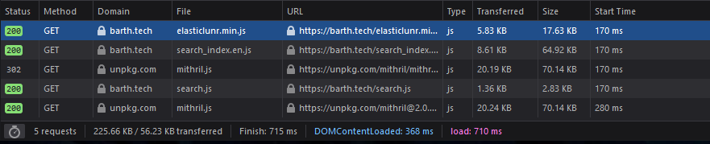

+++
title = "Search on a static site"
description = "Light weight search results with the Zola static site framework"
date = 2020-11-16
draft = true

[taxonomies]
technologies = ["mithril.js", "Zola", "elasticlunr", "javascript"]
tags = ["search"]
+++

[Zola](https://www.getzola.org/) is an awesome static site generator written in
Rust. Zola you can render a statically generated search index file. But that is
it! That is all it gives you! It is up to you to display the search results on
your site. Here I am offering a dead simple solution that should work for most
sites and templates. I am currently using the well supported
[Hyde](https://github.com/getzola/hyde) theme for Zola until inspiration (or
boredom) strikes.

In this article I will attempt to use this blog's simple article search feature
to show you a few things about design choices, full text search techniques, and
frontend development. If you want to skip the lesson on how it works and just
want to know how to use it in your Zola site skip to "[Using it for our
site](#using-it-for-our-site)". Some parts may not interest you, so I encourage
you to see what is here and skip to what does interest you. The rest is always
here if you need it.


## Design Choices

There are a set of design choices both on the part of Zola and by me when I
integrated their solution with this site. We can talk about why we
made those choices and what we might be giving up by doing things the way we
are. Many of them are
made by Zola and elasticlunr. The result is a very simple, yet powerful system
that can be hosted anywhere and run without any backend server code to power the
search feature.

### Choice: Searching on the frontend

Pros:
* All of the heavy lifting of running the entire site's content through the
  search pipeline and building an index is done exactly once, when we compile
  the site. This means the user never pays the runtime cost of all that indexing
  and we only ever update the search index when something changes on the site.
  Perfectly optimal!
* Running the actual search in JavaScript on the frontend means that we do not
  have to pay for any backend servers or databases. This makes the site much
  easier to host of free / cheap services like Github pages.

Cons:
* Anytime we want to show the user search results they have to download the
  entire search index and the code required to run the search. Downloading a
  huge search index could be really slow!
* If the user has JavaScript disabled or blocked they cannot see any search
  results. This is not an issue with a backend run / rendered search results
  page.

In our case the trade-offs are well worth the benefits. A search index over the
content created by a single individual will never grow large enough to cause an
issue. It would be impractical for say Google to run their search this way.
There is no way to fit an index of the entire internet on your personal
computer, let alone download it every time you search their site. For a blog
with a single author we do not have the same issues. At our current file sizes
our search results page still loads in under a second on a 56K modem.

### Choice: Simple HTML search submission form and dedicated results page

Pros:
* We can use a static form for the actual search box. This makes it very simple
  to use on every page of the site.
* We can leverage the built-in logic present in every browser. This means a lot
  less code since you do not need to implement the same behavior yourself.
* We only need to load the "heavy" JavaScript library and search index files
  when the user actually needs them on the results page instead of on every
  page.

Cons:
* No real-time search or suggestions. It is just an input box with no fancy
  behavior.
* The page will reload whenever the user runs a search.

This was actually a choice that I did not make originally, and ended up
rewriting the feature due to a bug.

Originally I went with a single page app
style [routed application](https://mithril.js.org/#routing). This created a LOT
of complexity. Partially because it meant I had 2 Mithril applications running
on every page! One handled the search box and modified the URL. The other
listened for URL changes and when there was a search query in the [URL
fragment](https://en.wikipedia.org/wiki/URI_fragment).

The bug I ended up having was because the routed app was not the one changing
the URL. The routed app is responsibly for managing the browser history
normally. Because it was only listening it did not update the browser history
properly. This would cause whatever page you were searching from to be repeated
in the browser history, effectively breaking the back button. **DO NOT BREAK THE
BACK BUTTON!**

I ended up with the much more traditional style I have now after a lot of
thought about the trade-offs and desire for something bulletproof and easy to
maintain. I had to give up some of the fancy search as you type and autosuggest
features. In the end I want to be writing posts, not messing with the search bar!

One of the benefits of this design is the results page is the only page to
to load any JavaScript libraries or the search index data. Altogether it amounts
to 50KB over the wire, but that will grow as the search index covers more
articles.



Normally I would bawk at the thought of removing features to get rid of some
bugs. In this case the users of this blog were not gaining any material value
out of these features. Most people will arrive from direct links for other sites
and never use the search.

## Diving into full text search

In this section we will look at how elasticlunr performs its magic. I am going
to walk through some of the real data structures generated for the search index,
and show with simplified code how they are doing things. When I simplified
something I will try to call it out along with the resulting differences from
the real implementation.

Setting `build_search_index = true` in Zola's `config.toml` file will use the
files in your `/content` directory to build a search index when the site is
compiled. This search index is
a JavaScript file that lives at `/search_index.en.js` on the finished site. The
extension will change according to the language set in your config. It is also
possible to have indexes for multiple different content languages.

If we peak into this language file we can see it contains a single statement:
`window.searchIndex = {...};`. Looking at the index data itself can also be
informative in understanding how the `searchIndex` is laid out.

```ts
// objects for this article are leygft structurally intact
// other nested [Object]'s are truncated for brevity'
{
  fields: [ 'title', 'description', 'body' ],
  pipeline: [ 'trimmer', 'stopWordFilter', 'stemmer' ],
  ref: 'id',
  version: '0.9.5',
  index: {
    body: { root: [Object] },
    description: { root: [Object] },
    title: { root: [Object] }
  },
  documentStore: {
    save: true,
    docs: {
      'http://barth.tech/': [Object],
      'http://barth.tech/resume/': [Object],
      'http://barth.tech/blog/': [Object],
      'http://barth.tech/blog/how-the-search-works/': {
        body: 'Zola is an awesome static site generator written in\n' +
          'Rust. As part of the Zola you can generate a statically generated search index.\n' +
          '<rest of the body truncated for readability>...',
        description: 'Light weight search results with the Zola static site framework',
        id: 'http://barth.tech/blog/how-the-search-works/',
        title: 'Search on a static site'
      },
      ...
    },
    docInfo: {
      'http://barth.tech/': [Object],
      'http://barth.tech/resume/': [Object],
      'http://barth.tech/blog/': [Object],
      'http://barth.tech/blog/how-the-search-works/': { body: 256, description: 8, title: 3 },
      ...
    },
    length: 7
  },
  lang: 'English'
}
```

The `searchIndex.index` object values are
[Trie](https://en.wikipedia.org/wiki/Trie) structures. I will not reproduce them
here since they are massive, but feel free to load up the [javascript
console](https://developers.google.com/web/tools/chrome-devtools/console/javascript)
for this page and go spelunking if you are curious. I include the index on this
page as `window.searchIndex`.

### The text processing pipeline

Zola creates a document index compatible with elasticlunr when the site is
generated. As the content documents are processed the fields are sent through a
text processing pipeline. From the data above we can see that it is trimming,
tokenizing, and then stemming each word. Let's try to walk through the same
pipeline to see how this process might work.

> Note that I am not using the actual elasticlunr pipeline functions for this
> walk through, just examples of what each step might do.

Pretend we have the following three documents:

```ts
let docs = [
  "The quick brown fox jumps over the lazy dog.",

  "Emmett Brown : No, no, no, no, no, this sucker's electrical, but I need a" +
  " nuclear reaction to generate the 1.21 gigawatts of electricity I need.\n" +
  "Marty McFly : Doc, you don't just walk into a store and-and buy plutonium!\n",

  "\"Mistletoe,\" said Luna dreamily, pointing at a large clump of white" +
  " berries placed almost over Harry's head. He jumped out from under it." +
  " \"Good thinking,\" said Luna seriously. \"It's often infested with nargles.\"",
];
```

#### Trimming

After running the trimmer step we can imagine our documents looking like the
following:

```ts
> function trimmer(documentText) { ... }
> let trimmed = docs.map(trimmer);
> console.log(trimmed);
[
  "The quick brown fox jumps over the lazy dog.",

  "Emmett Brown : No, no, no, no, no, this sucker's electrical, but I need a" +
  " nuclear reaction to generate the 1.21 gigawatts of electricity I need.\n" +
  "Marty McFly : Doc, you don't just walk into a store and-and buy plutonium!",

  "\"Mistletoe,\" said Luna dreamily, pointing at a large clump of white" +
  " berries placed almost over Harry's head. He jumped out from under it." +
  "\"Good thinking,\" said Luna seriously. \"It's often infested with nargles.\"",
]
```

Spot the difference? The only change is the removal of trailing whitespace on
the end of the Marty McFly's quote. We could also imagine if we ended up with a
lot of long articles (like this one!) in our search index the trimmer could be
responsible for cutting document bodies down to a maximum character limit.
Optimizations like trimming our content might come at the cost of not being able
to search every word in the article, but we can use things like searching
through tags on our documents to make up for that loss in fidelity.

#### Tokenizing

Tokenization is the process of chopping text up into tokens or words. We can
imagine tokenization looking like the following. elasticlunr calls this step in
the pipeline `stopWordFilter`. This is because the tokenizer function is usually
looking for things like whitespace and punctuation that marks the boundaries
between words (at least in romantic languages!). In other words (heh!) where do
the words stop!

```ts
> function tokenize(documentText) { ... }
> let tokenized = trimmed.map(tokenize);
> console.log(tokenized);
[
  ['The', 'quick', 'brown', 'fox', 'jumps', 'over', 'the', 'lazy', 'dog'],

  ['Emmett', 'Brown', 'No', 'no', 'no', 'no', 'no', 'this', "sucker's",
   'electrical', 'but', 'I', 'need', 'a', 'nuclear', 'reaction', 'to',
   'generate', 'the', '1.21', 'gigawatts', 'of', 'electricity', 'I', 'need',
   'Marty', 'McFly', 'Doc,', 'you', "don't", 'just', 'walk', 'into', 'a',
   'store', 'and', 'and', 'buy', 'plutonium'],

  ['Mistletoe', 'said', 'Luna', 'dreamily', 'pointing', 'at', 'a', 'large',
   'clump', 'of', 'white', 'berries', 'placed', 'almost', 'over', "Harry's",
   'head', 'He', 'jumped', 'out', 'from', 'under', 'it', 'Good',
   'thinking', 'said', 'Luna', 'seriously', "It's", 'often', 'infested',
   'with', 'nargles']
]
```

Now instead three strings for documents we have 3 lists of strings representing
the words in each document. In a real application we would also have to store
the index of the start of each word in the original string because we no longer
know how much whitespace was between each word. Not storing this information in
this example means that features like highlighting the matched term in the
context of the original text is not possible using just the information in the
search index.

Notice how none of the tokens have any punctuation in them either. The quotes,
periods, exclamation marks, and whiteapce is all gone. The only thing remaining
resembling punctuation are the apostrophes in the contractions.  Punctuation is
not usually relevant to people's searches. This is one of the first examples
where we can see a sacrifice the authors of elasticlunr make a compromise. Their
search technique is only good for finding words, not symbols or punctuation.
These trade-offs may be desirable for different situations. The shown strategy
works great for prose like blog posts, but is awful for example searching source
code or Twitter usernames.

#### Stemming

Stemming is the process of taking words and converting them to their "base"
form. In English this usually means making all the words lower case, singular,
and in the present tense.

```ts
> function stem(word) { ... }
> let stemmed = tokenized.map(tokens => tokens.map(stem));
> console.log(stemmed);
[
  ['the', 'quick', 'brown', 'fox', 'jump', 'over', 'the', 'lazy', 'dog'],

  ['emmett', 'brown', 'no', 'no', 'no', 'no', 'no', 'this', "sucker",
   'electric', 'but', 'i', 'need', 'a', 'nuclear', 'react', 'to',
   'generate', 'the', '1.21', 'gigawatt', 'of', 'electric', 'i', 'need',
   'marty', 'mcfly', 'doc,', 'you', 'do', 'not', 'just', 'walk', 'into', 'a',
   'store', 'and', 'and', 'buy', 'plutonium'],

  ['mistletoe', 'say', 'luna', 'dream', 'point', 'at', 'a', 'large',
   'clump', 'of', 'white', 'berry', 'place', 'almost', 'over', "harry",
   'head', 'he', 'jump', 'out', 'from', 'under', 'it', 'good',
   'think', 'say', 'luna', 'serious', 'it', 'is', 'often', 'infest',
   'with', 'nargle'],
]
```

The process of the stemming transformation can be very dependent on the
language. For example if we were trying to build a stemmer for Spanish we might
have to conjugate all the verbs back to their base form or remove the gendered
suffixes.

You may start to see some patterns emerging. Notice the "brown" tokens in the first and
second documents are now identical, even though the instance in the second
document was originally capitalized as part of Doc Brown's name. "jump" now
matches in the first and third despite being different tenses in the original.

Many of the word stemming transformations were not straight forward. It is not
as simple as just dropping "ed", "s", and "ing" endings. English is full of edge
cases. "said" became "say" while "electricity" and "electrical" both became
"electric". The actual elastic lunr library likely does not make these exact
same transformations. In fact real stemmers sometimes create stems that only
vaguely resemble their english base words. What is important is the many
conjugations of the same word all get transformed into the same stem.

### Using the trie

The primary data structure leveraged by elasticlunr in its index is the trie.  A
trie is a type of tree data structure. It has nice properties when looking up
results because the lookup time depends on the length of the query and not the
amount of content it has indexed. The cost is it is not very space efficient due
to the high number of pointers used. This is a pretty good performance
characteristic for a web search where most queries will be a couple words.

Below I setup a very simple example trie class. It is documented so you can
understand what it is doing and how it is doing it. The most important thing to
notice is that, like most trees, this trie is a recursive data structure. Each
child property, except for `locations`, is another instance of the Trie.

```ts
class Trie {
  constructor() {
    this.locations = new Set();
  }

  addTerm(term, docLocation) {
    // define a recursive function that will traverse the trie and add the
    // docLocation to the correct node, building the trie as it needs to
    const build = (text, tree) => {
      // base case: no text is left to find in the trie
      // add the term's location to the node's locations list
      if (!text) {
        tree.locations.add(docLocation);
        return;
      }
      const firstChar = text[0];
      // if there is not a node that already exists for this branch of the trie,
      // create an new empty node and add it to the current node at the index of
      // the first character.
      if (tree[firstChar] === undefined) {
        tree[firstChar] = new Trie();
      }
      // continue to traverse the next node of the tree with the first letter of
      // the text taken off
      build(text.slice(1), tree[firstChar]);
    };
    // start the traversal
    build(term, this);
  }

  // Find all the documents containing the term. Returns a list of matching
  // document locations.
  find(term) {
    // Recursive function to find our term in the tree
    const f = (text, tree) => {
      // when there is no further text to
      if (!text) {
        return tree.locations;
      }
      const firstChar = text[0];
      if (tree[firstChar] === undefined) {
        // the text is not found in the tree, return an empty list of locations
        return new Set();
      } else {
        // next node was found, continue the traversal with the rest of the text
        return f(text.slice(1), tree[firstChar])
      }
    };
    // start the traversal, return the result when it is done
    return f(term, this);
  }
}
```

### Building the index

We need to load our processed documents into our trie so we can use it as our
search index. This is the step the Zola performs when it is building the site.

```ts
// iterate over each document so we can add its tokens to the index
let index = stemmed.reduce((tokens, trie) => {
    // quick and dirty document ids
    // the first document will have a docId === 0 and count up from there
    trie.docId = trie.docId === undefined ? 0 : trie.docId + 1;
    for (let token of tokens) {
      // add each token to the trie pointing at the current docId
      trie.addTerm(token, trie.docId);
    }
    return trie;
}, new Trie());
```

> Again in a real application we probably would have carried along the document
> ID and location in the document as part of the token object instead of this
> quick and dirty method of calculating the document ID.

Thats it! We have our search index. Just for an idea of what we are building,
here is the console representation of our trie after we add our first document
to it. Notice if you read across each line you can see the first 3 letters of
several words in our document as keys in our nested Trie objects.

```ts
> console.log(trie)
Trie {
  locations: [],
  t: Trie { locations: [], h: Trie { locations: [], e: [Trie] } },
  q: Trie { locations: [], u: Trie { locations: [], i: [Trie] } },
  b: Trie { locations: [], r: Trie { locations: [], o: [Trie] } },
  f: Trie { locations: [], o: Trie { locations: [], x: [Trie] } },
  j: Trie { locations: [], u: Trie { locations: [], m: [Trie] } },
  o: Trie { locations: [], v: Trie { locations: [], e: [Trie] } },
  l: Trie { locations: [], a: Trie { locations: [], z: [Trie] } },
  d: Trie { locations: [], o: Trie { locations: [], g: [Trie] } }
}
```

Now given a search term we can get back the set of documents it appears in.

```ts
> index.find("brown")
Set(2) { 0, 1 }
```

It works! But what happens if we search a term that does not exist?

```ts
> index.find("foobar")
Set(0) {}
```

We get back an empty set!

Now what happens if we search something very similar to a term we know is in the
index?

```ts
> index.find("Brown")
Set(0) {}
```

It cannot find it! But "Brown" literally appears in the original document,
character for character. We expected to get back a set with a document ID of 1.

Our trie based search index has no idea that when it looks up the "B" in "Brown"
that it should access the tree under the "b" key.  So how do we give our users
back the useful results when we expect?

### Running the Search and Scoring

There is one last thing to do to make our search functionality complete. Before
we run the query given by the user through our `Trie.find()` method we have to
run the query itself through the same pipeline we used to build the index. This
is why the pipeline steps are stored by elasticlunr as part of its search index
data.

```ts
// Returns all documents matching a given query
function search(index, query) {
  // Run the query through our text processing pipeline, and count the number of
  // terms each document matches.
  let matchData = pipeline(query).reduce(term, matches => {
    const termMatches = index.find(term);
    for (let docId of termMatches.values()) {
      if (matches[docId]) {
        matches[docId] += 1;
      } else {
        matches[docId] = 1;
      }
    }
  }, {});
  // transform the matchData into something sortable
  let matches = [];
  for (let docId in matchData) {
    matches.push({docId, matchCount: matchData[docId]})
  }
  // run the sort, with the highest number of matches at the front of the list
  matches.sort((a, b) => b.matchCount - a.matchCount);
  return matches;
}

> search("generate a gigawat")
[{docId: 1, matchCount: 3}, {docId: 0, matchCount: 1}, {docId: 2, matchCount: 1}]
```

This simple search function returns the document that matches the greatest
number of search terms from our query. There is an entire spectrum of techniques
for scoring results. From methods as simple as this to making terms that appear
more often in documents count less towards the document's match score, or
matching via synonyms, or [Bayesian
inference](https://en.wikipedia.org/wiki/Bayesian_inference) (how often words
occur together).

> Words with a high frequency of occurrence in documents are often things like
> articles (the, an, a), prepositions (in, on, of), or pronouns (I, his, her, it).
> These words do not usually carry as much meaning for the user compared to a
> fairly unique word. Consider the query "the nargle". "the" matches every one
> of our documents (multiple times!). "nargle" has only a single match in the
> last document. If a user were to give us this query chances are they would
> want to see the last document.

## Using it for our site

Are you still with me? If you made it this far we get to see how this all plays
out in our actual application. Knowing the about how the search algorithm works
will help you tune the functionality down the line. For now we can stick to
using the (pretty good) library defaults.

The overview of our application flow is. The user enters their query into a
static HTML form, our search box. When the form is submited the browser will
perform a GET request with the user's query embedded in the URL to our results
page. The results loads as an empty page with just our search script. After the
results page loads we run the script to read the query out of the url, run the
search, and render the results on the page.


### Search box

The search box is as simple as it gets: just a standard HTML form with a single
input field. Functionally it boils down to just a couple lines.

```html
<form action="/search" method="GET">
    <input id="search-box" name="q" type="search" placeholder="Search site..."/>
</form>
```

If you are new to frontend development and HTML let me break down a few pieces
for you.  The rest of you can skip ahead to the [next section](#results-page).
First `action="/search"`. The form action is where the form data is submitted.
`method="GET"` is tells the browser that the data will be sent in the form of a
GET request. When the user types a query and hits enter the browser will
redirect to `{domain}/search?q={query}`. `/search` is the address of out search
results page. In the results page we will use the information passed in the
query string to search the index and render the results.

### Results page

[Mithril](https://mithril.js.org/#what-is-mithril) is a neat
[FRP](https://en.wikipedia.org/wiki/Functional_reactive_programming) style
framework in the same vein as React. It is super light weight and its small API
footprint makes it easy to learn. Even for someone that normally sits on the
backend engineering team in their day job. The `m` variable seen throughout the
next few code snippets is Mithril. In its most basic form `m.render()` Takes any
object with a `.view()` function that when called with a VDOM ([virtual
DOM](https://stackoverflow.com/questions/21965738/what-is-virtual-dom)) object
returns a new vDOM object. `m()` is Mithril's DOM constructor function.

```ts
document.addEventListener('DOMContentLoaded', _evt => {
  const searchResultsTarget = document.getElementById('search-results');
  const url = new URL(window.location.href);
  const query = url.searchParams.get('q');

  if (searchResultsTarget && query) {
    m.render(searchResultsTarget, m(SearchResults, {query}));
  }
});
```

The template and content files are very bare bones since all we need on the
resulting page are our javascript files and the `#search-results` element to
bind to.

I alternatively could have used Mithril's `m.mount()` to render the search
results, but it this case it was unnecessary since the page is effectively
static and we only need to render the results once on load.

The `m(SearchResults, {query})` initializes a new `SearchResults` component and
sets the value of `query` on the VDOM element `attrs`. When the component is
first initialized we load the contents of `window.searchIndex` into and
elasticlunr index. The Mithril framework well then call the `.view()` method on
the returned object. This simple mechanism allows a lot of flexibility when
creating your components to build them via classes, classic JavaScript style
prototypes, or as returned objects from functions as I do here.


```ts
const SearchResults = () => {
  const index = elasticlunr.Index.load(window.searchIndex);

  return {
    view: (vnode) => {
      let classes = ['search-results'];
      let query = vnode.attrs.query;
      let results = index.search(query);
      let resultContent = [m('h1', `Search results for "${query}"`)];
      if (results.length) {
        resultContent.push(...results.map(result =>
          m(ResultEntry, {highlight: query, ...result})));
      } else {
        resultContent.push(m('p', 'No results found.'));
      }
      return m('div', {'class': classes.join(' ')}, resultContent);
    }
  }
}
```

When the `view()` method is called we call `index.search(query)` with our string
extracted from the URL and save the output in `results`. We then build a
`resultContent` list of VDOM objects, starting with a header telling the user
what we searched for. If there are any results we render the content of each
result into a `ResultEntry` component, and push it into the `resultContent`. If
there are no results found we return a message letting the user know so they do
not mistake the lack of results for a problem with our application. Finally we
wrap the `resultContent` in a root DOM object with any classes we need for
styling and return it. From there Mithril renders the returned VDOM tree into
real DOM elements as children of the node we originally passed to `m.render()`.

## Wrapping up

There you have it! We have a perfectly functional search feature on our static
site and a decent understanding of how it works. If you have any questions or
comments drop me a line. The contact form should be up any day now (I hope)!
Otherwise you can contact me on twitter @rbar256. See you around!

<!--included for search index section-->
<script src="/search_index.en.js" type="text/javascript"></script>
